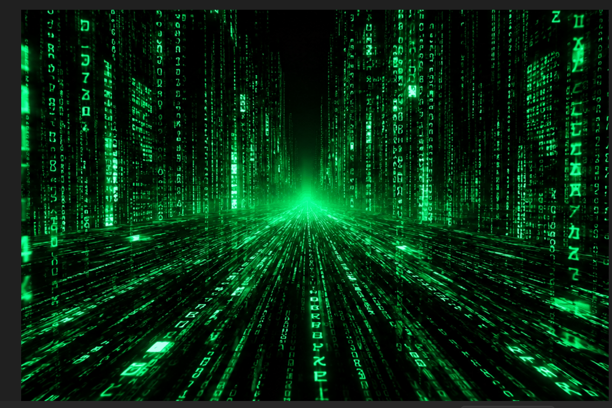

# Cyber Matrix Full-Screen Animation

A futuristic Matrix-inspired full-screen video background project built with HTML and CSS.

## Live Demo

https://cydlockdev-bit.github.io/Cyber-Matrix-Full-Screen-Animation/

## GitHub Repository

https://github.com/cydlockdev-bit/Cyber-Matrix-Full-Screen-Animation.git

## About This Project

**Cyber Matrix Full-Screen Animation** is a front-end practice project designed to improve my HTML and CSS layout skills while learning how to use video as a visual background.

The goal of this project was to create a futuristic Matrix-inspired landing page using a full-screen animated video, dark colors, responsive sizing, and clean page structure.

This project helped me understand how HTML, CSS, media files, and performance all work together in a real web page.

## Features

- Full-screen Matrix-inspired video background
- Responsive viewport-based layout
- Dark futuristic visual theme
- HTML5 video element
- Autoplay, muted, loop, and playsinline video settings
- CSS image/video scaling with `object-fit: cover`
- Clean project structure for GitHub Pages
- Portfolio-ready front-end project

## Technologies Used

- HTML5
- CSS3
- HTML5 Video
- VS Code
- GitHub
- GitHub Pages

## What I Learned

- How to structure a small front-end web project
- How to use the HTML `<video>` element
- How to add a video background to a webpage
- How to use `autoplay`, `muted`, `loop`, and `playsinline`
- Why video files like MP4 are better than large GIFs for web performance
- How to reduce large media file sizes for GitHub and faster loading
- How to use `object-fit: cover` to make media fill the screen
- How to use viewport units like `100vw` and `100vh`
- How to organize project files for GitHub Pages
- How to prepare a visual project for my portfolio

## Screenshots

## Future Improvements

- Add text and buttons over the video background
- Improve mobile responsiveness
- Add a pause/play button for accessibility
- Add fallback content for browsers that do not support video
- Add more accessibility features
- Add a project description section on the live page
- Experiment with JavaScript animation effects

## Author

John Syders
